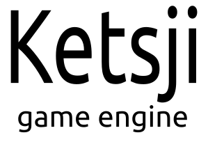

# About

The Ketsji Game Engine is a fork of the Unchronia Project Blender Game Engine (UPBGE): https://upbge.org/ which began as a fork of the Blender Game Engine circa 2015 by Porteries Tristan.

Ketsji is meant to be a stand-alone project seperate from both Blender and UPBGE which have both seeminfly ceased development on the game engine.

# Back to our Roots

Ketsji was the original name of the Blender Game Engine -- and it's got a catchy name to it. We strive to return Ketsji to its roots as outlined in the original design document from the year 2000 -- albeit not slavishly:

https://docs.blender.org/api/intranet/docs/develop/KetsjiGameEngine.htm

```
Ketsji Game Engine Framework, Design Document

Erwin Coumans

May 8, 2000

Decision 1.
Ketsji can be both used as a stand-alone application as well as an embedded
system. It can be part of Blender, in which there is a data connection and
user-interface sharing in such a way that there is a smooth transition. When
Ketshi (sic) is used stand-alone the user can play a game on it.

Decision 2.
The design of the game engine is done in an object-oriented fashion. There are
several reasons for this [see Barenbrug 2000 chapter 3.1.3], some of which are:

Object orientation allows for a common language in discussing and reasoning
about the system in all of its views.

Object oriented design allows for a clear separation between interface and
implementation, this allows for a higher level of abstraction at the interface
level, which aids in clearer (and often smaller) interfaces.

Object orientation supports several constructs (such as inheritance and object
composition) to specify relations between subcomponents (classes).

Many components (like physics, audio and graphics components) are easier to
incorporate within an object-oriented designed framework.

Decision 3.  Ketsji consists of are large collection of building blocks, also
called Game Objects.

These building blocks are the entities that form the atomic data of the game,
similar to the Lego bricks. Think of Players, Non Player Characters (NPC),
Sounds, Lights, Particle Systems and so on.

Decision 4.  The game logic of Ketsji (also called soft architecture) is build
using building blocks of three categories Actuators, Controllers and Sensors.

Components usually fit within one of those categories, and are optional (when
a certain platform doesn’t support a specific Actuator, the Actuator can be
left out, without problems).

Decision 5.  A type-less connection is used for communication between
Sensor/Controller/Actuator building blocks, it is the users responsibility to
build a meaningful system.

Sensors, Controllers and Actuators that communicate over a uniform channel are
backward and forward compatible, and that channel can be queried for addition
information. This way there are very little dependencies created (neither
between bricks nor between brick and communication channels). Also it makes
the system more flexible for users.

Decision 6.  Data is managed by one ore more accompanying event managers that
take care of the real-time performance issues.

Event managers will work in a certain area and can cooperate with other
managers. For performance reasons there is a mechanism (Solid can add this
functionality) that keeps track of objects that potentially can generate
events.

Decision 7.  The game loop consists of several stages that are handled
sequentially.

[todo: explain stages,  game logic stage (scripted), physics stage, rendering
stage. Feedback of physics stage (and collision stage) is not used for the
current frame but for the next.

Decision 8.  Inheritance from the Actuator, Sensor and Controller interface
classes is used to make the framework extensible.

This way there can be different kind of Controllers (for example Python
Controllers, AI Controllers, Graphically Scripted Controllers) in a
transparent way. Same for Actuators and Sensors.

Decision 9.  The hardware specific, platform dependent and low-level tasks are
abstracted.

There will be a general-purpose libraries for things like String classes,
Input/Output, File-system issues etc.

Decision 10. Game Objects are created by a central mechanism. Components have
to register themselves to this mechanism in order to be used.

Decision 11. Game objects own a Knapsack that can be filled with type-less
Properties (Properties are “named Game objects”).

```
# Contributing

Send a pull request! Open an issue! Whatever you do -- do something! The BGE was too good to let die and Ketsji is too good to let stagnate!

